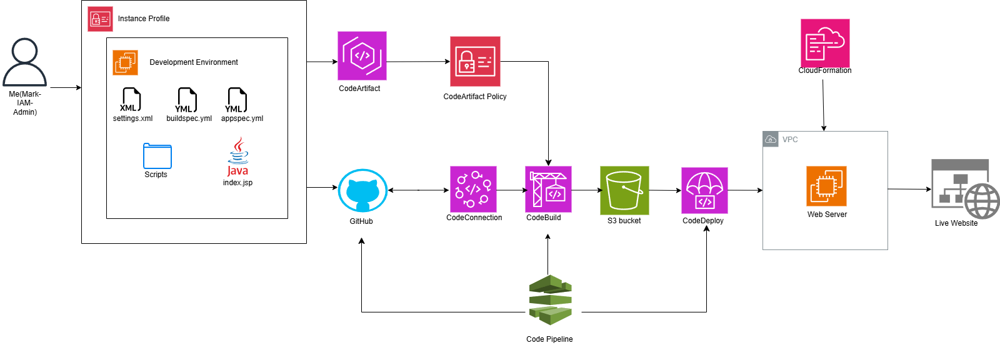

# 🚀 AWS CI/CD Pipeline for Java Web Application

Built a fully automated CI/CD pipeline using AWS services to deploy a Java web application from source to production.

## 🏗️ Architecture Overview



## 🧠 What This Project Does

- Automatically builds and deploys a Java web app
- Uses a full AWS CI/CD pipeline (CodePipeline → CodeBuild → CodeDeploy)
- Stores and manages artifacts using CodeArtifact and S3
- Deploys to an EC2 instance with a running web server

## 🧰 Tech Stack

- AWS: EC2, IAM, CodePipeline, CodeBuild, CodeDeploy, CodeArtifact, S3, CloudFormation
- Tools: Maven, Git, GitHub, VS Code
- Runtime: Java (Amazon Corretto 8)

## ⚙️ Step-by-Step Implementation
# 1. IAM Setup
- Created IAM user: Mark-IAM-Admin
- Assigned AdministratorAccess
- Created custom IAM policy for CodeArtifact:

```json
{
  "Version": "2012-10-17",
  "Statement": [
    {
      "Effect": "Allow",
      "Action": [
        "codeartifact:GetAuthorizationToken",
        "codeartifact:GetRepositoryEndpoint",
        "codeartifact:ReadFromRepository"
      ],
      "Resource": "*"
    },
    {
      "Effect": "Allow",
      "Action": "sts:GetServiceBearerToken",
      "Resource": "*",
      "Condition": {
        "StringEquals": {
          "sts:AWSServiceName": "codeartifact.amazonaws.com"
        }
      }
    }
  ]
}
```
- Attached policy to EC2 role for artifact access

# 2. EC2 Instance Setup
Region: Ohio (us-east-2)
- Launched EC2 instance
- Created and downloaded key pair
- Connected via VS Code SSH (Remote) using public DNS

# 3. Development Environment Setup
Installed on EC2:
- Git
- Apache Maven
- Amazon Corretto 8

Configured:
- settings.xml for Maven
- SSH access via VS Code
- GitHub repo connection

# 4. Application Setup
- Pulled project code into EC2
- Modified index.jsp
- Verified project structure
- Ran Maven build commands → Build successful

# 5. Source Control Integration
- Linked EC2 to GitHub repo
- Committed and pushed application code
- Verified repository structure
- 
# 6. CodeArtifact Integration
- Created repository
- Configured authentication token
- Updated IAM role permissions
- Successfully retrieved dependencies
  
# 7. CI/CD Pipeline Setup

🔹 CodePipeline Stages
1. Source
- Connected to GitHub repo
2. Build
-YAML configuration used
-Initial failures resolved by:
  - Fixing IAM permissions
  - Updating build spec
3. Deploy
- Used CodeDeploy agent
- Configured deployment scripts
  
# 8. Build & Deployment Fixes
- Encountered YAML build failures → corrected syntax
- Fixed IAM permission issues for CodeArtifact
- Verified artifact upload to S3
- Ensured EC2 role had proper access
  
# 9. Infrastructure as Code
- Used CloudFormation template to deploy resources
- Included:
  - EC2
  - IAM roles
  - Pipeline components
    
# 10. Deployment Scripts

Created scripts for:
- Installing dependencies
- Application startup
- Deployment lifecycle hooks
  
# 11. Final Deployment
- CodeDeploy completed successfully
- Pipeline executed end-to-end
- Application deployed and accessible

✅ Website fully operational


🔄 CI/CD Pipeline Flow
1. Developer pushes code → GitHub
2. CodePipeline triggers
3. CodeBuild compiles using Maven
4. Artifact stored (S3 / CodeArtifact)
5. CodeDeploy deploys to EC2
6. Web app becomes available

🧠 What I Learned
1. How to design and implement a full CI/CD pipeline on AWS
2. IAM role and policy troubleshooting (real-world scenario)
3. Debugging build failures (YAML + permissions)
4. Integrating multiple AWS services into one workflow
5. Using infrastructure as code with CloudFormation
6. End-to-end deployment automation

## 📂 Repository Structure
```
/app-source
/scripts
  install.sh
  start.sh
  deploy.sh
buildspec.yml
appspec.yml
README.md
```
